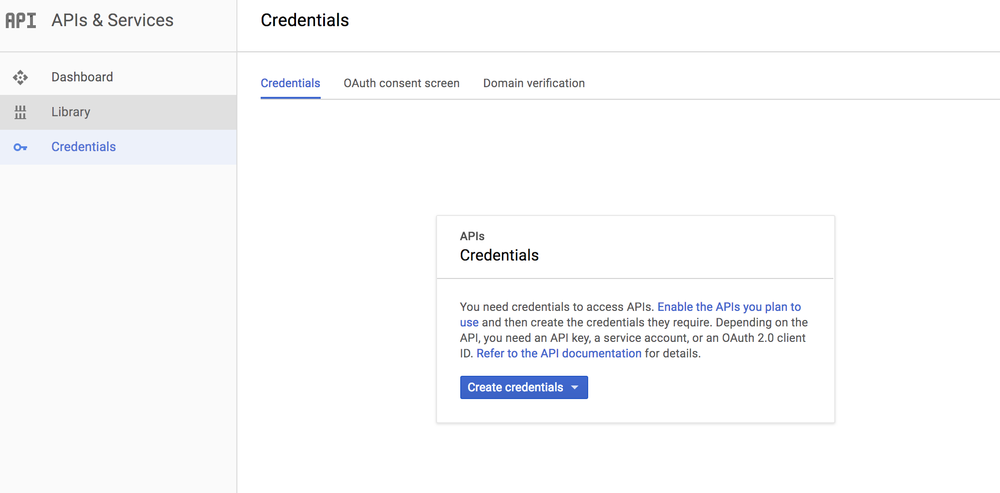
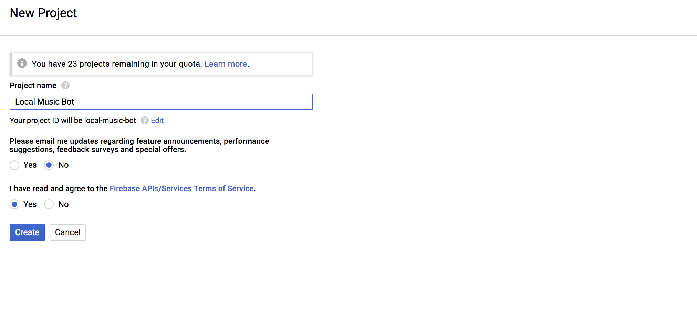
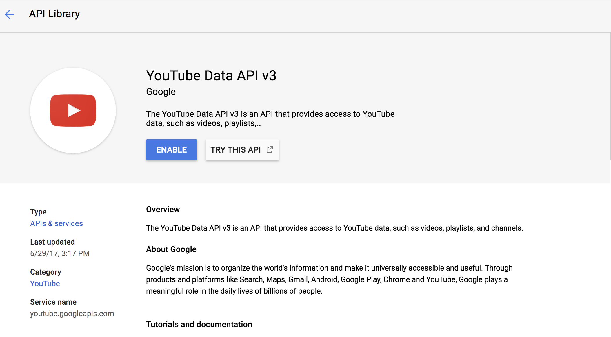
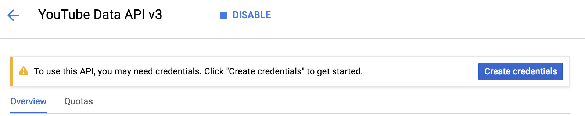
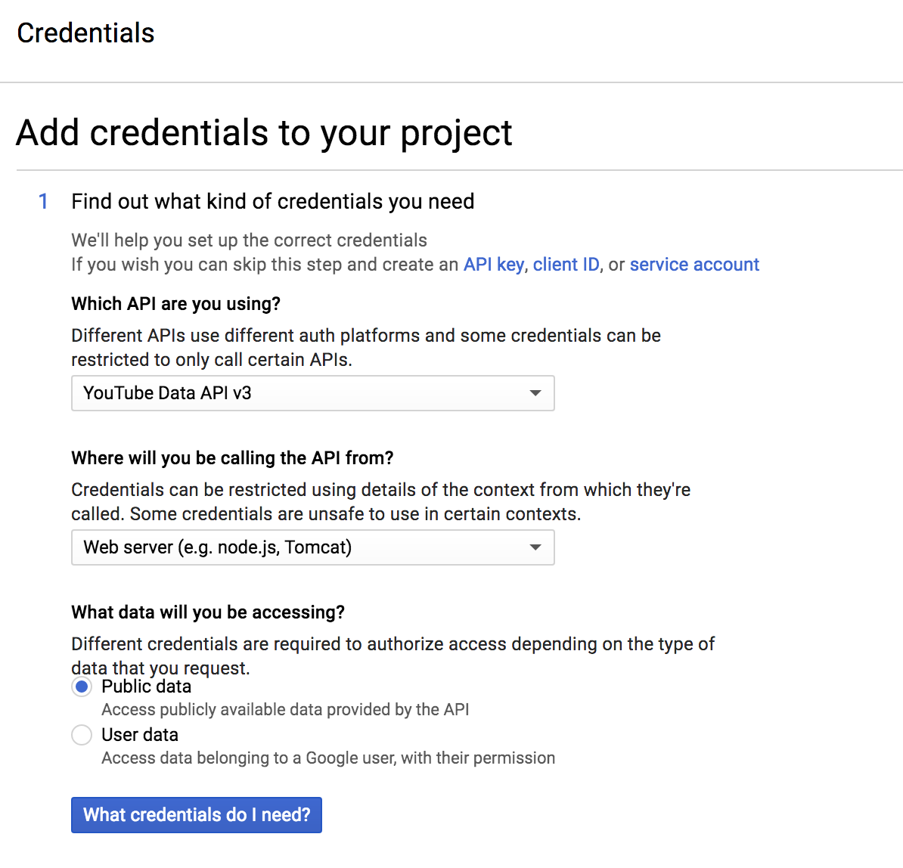
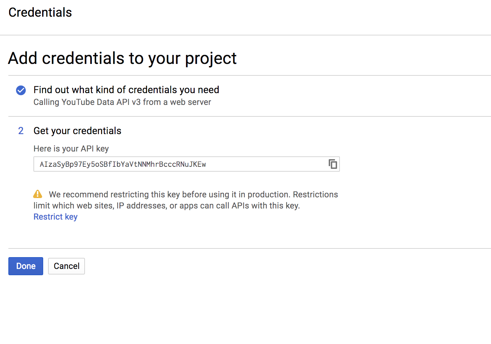
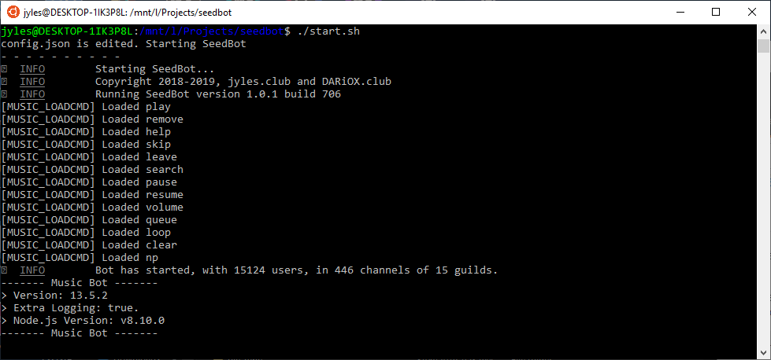

# How to install SeedBot on Debian<br>
### Step 1: Downloading SeedBot<br>
Download SeedBot by using  `git clone` or `wget`

If you want to use `git clone` then type this in your terminal of choice

`git clone https://github.com/jylescoad-ward/seedbot.git`

then type

`unzip seedbot-master.zip`


**If you want to use wget then follow the instructions below**

Type in your console of choice

`wget https://github.com/jylescoad-ward/seedbot/archive/master.zip`

then unzip it using `unzip`

`unzip master.zip`

and change the name to something that you will remember

`mv master/ mybot/`

### Step 2: Making a Bot User
To make a bot I suggest using this guide to help you

https://www.digitaltrends.com/gaming/how-to-make-a-discord-bot/


### Step 3: Adding your Own Token
To get your bot token go in the bot tab on your application

and click the `Copy` button below the `Click to Reveal Token` button


Then go into the config file which is in `src/config.json` and open it up in your perfered text editor and replace the text `token-here` in the second line.


With your token that you got from your Discord Bot Application Page


It should look a bit like this

### Step 4: Adding your Youtube API v3 Token
1. Go to your credential page using this link

https://console.developers.google.com/apis/credentials

2. Click on create project



3. Enter a project name




4. Go to the library on the left hand side


5. Search for Youtube API v3 and Enable it




6. Click on Create Credentials



7. Select **Youtube API** with the **Web Server** setting



8. Copy your API key



9. Go **back** in to the `config.json` file and replace `youtube-api-token` on line 6 with your own API key


### Step 4: Installing the bot
To install the bot go into the root directory (where changelog.txt is) and type this in to your console

```bash
sudo chmod +x install-apt.sh || sudo chmod +x start.sh || sudo chmod +x update.sh
```
Then type in your console

```bash
sudo ./install-apt.sh
```

and to update the bot do this command

```bash
sudo ./update.sh
```

Once you have done that you can now start your bot!

### Step 5: Starting the Bot
To start your bot type this in your console

```bash
./start.sh
```
And your console should spit this out




### Congratulations! You did it!
If there are any problems don't hesitate to make a issue on the issue tab.<br>


Have a fantastic day!
