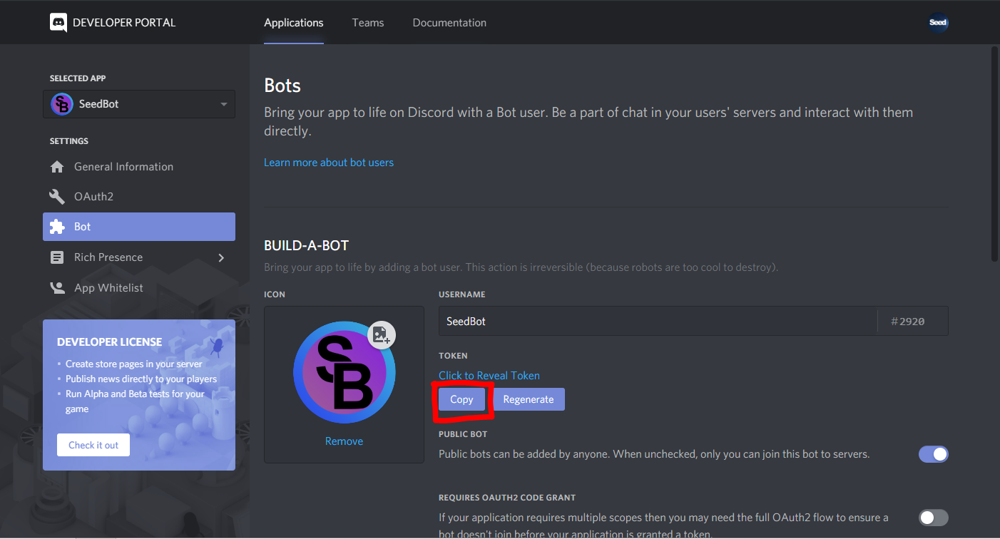
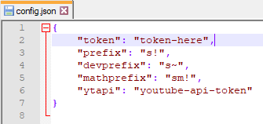
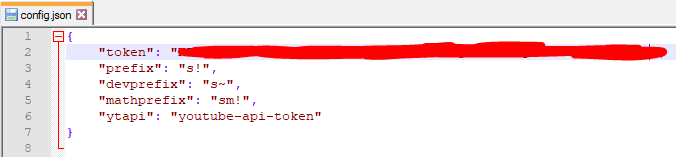
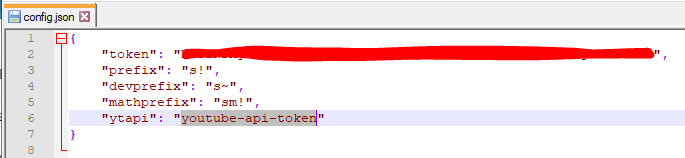
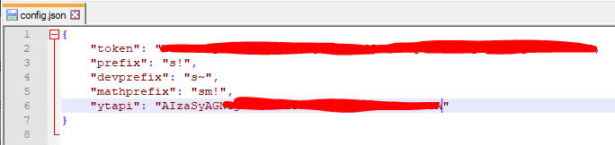

# How to install SeedBot on Debian<br>
### Step 1: Downloading SeedBot<br>
Download SeedBot by using  `git clone` or `wget`<br>
If you want to use `git clone` then type this in your terminal of choice<br>
`git clone https://github.com/jylescoad-ward/seedbot.git`<br>
then type
`unzip seedbot-master.zip`<br>
<br>
**If you want to use wget then follow the instructions below**<br>
Type in your console of choice<br>
`wget https://github.com/jylescoad-ward/seedbot/archive/master.zip`<br>
then unzip it using `unzip`<br>
`unzip master.zip`<br>
and change the name to something that you will remember<br>
`mv master/ mybot/`<br>
<br>
### Step 2: Making a Bot User
To make a bot I suggest using this guide to help you<br>
https://www.digitaltrends.com/gaming/how-to-make-a-discord-bot/<br>
<br>
### Step 3: Adding your Own Token
To get your bot token go in the bot tab on your application<br>
and click the `Copy` button below the `Click to Reveal Token` button<br>
<br>
<br>
<br>
Then go into the config file which is in `src/config.json` and open it up in your perfered text editor and replace the text `token-here` in the second line.<br>
<br>
With your token that you got from your Discord Bot Application Page<br>
<br>
It should look a bit like this ^<br>
<br>
### Step 4: Adding your Youtube API v3 Token
1. Go to your credential page using this link<br>
https://console.developers.google.com/apis/credentials<br>
2. Click on create project<br>
<br>
3. Enter a project name<br>
<br>
<br>
***Enable Youtube API***<br>
1. Go to the library on the left hand side<br>
<br>
2. Search for Youtube API v3 and Enable it<br>
<br>
<br>
***Getting the Youtube API Key***<br>
1. Click on Create Credentials<br>
<br>
2. Select **Youtube API** with the **Web Server** setting<br>
<br>
3. Copy your API key
<br>
4. Go **back** in to the `config.json` file and replace `youtube-api-token` on line 6 with your own API key<br>
<br>
<br>
<br>
### Step 4: Installing the bot
To install the bot go into the root directory (where changelog.txt is) and type this in to your console<br>
```bash
sudo chmod +x install-apt.sh || sudo chmod +x start.sh || sudo chmod +x update.sh
```
Then type in your console<br>
```bash
sudo ./install-apt.sh
```

and to update the bot do this command<br>
```bash
sudo ./update.sh
```

Once you have done that you can now start your bot!

### Step 5: Starting the Bot
To start your bot type this in your console<br>
```bash
./start.sh
```
And your console should spit this out<br>
<br>
<br>
<br>
### Congratulations! You did it!
If there are any problems don't hesitate to make a issue on the issue tab.<br>
<br>
Have a fantastic day!
